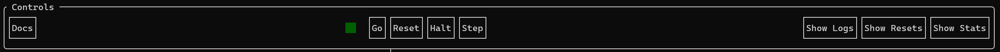
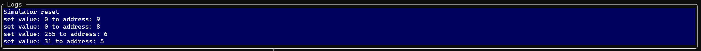
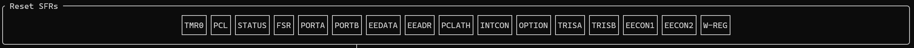
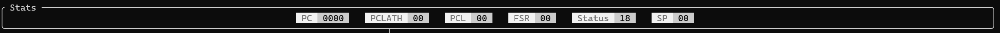
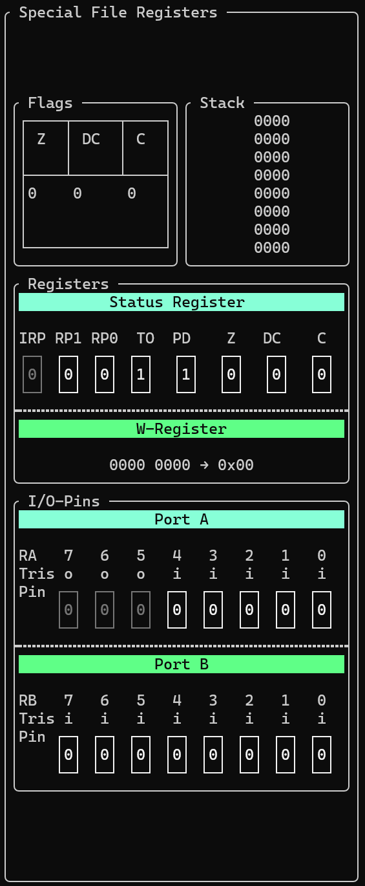
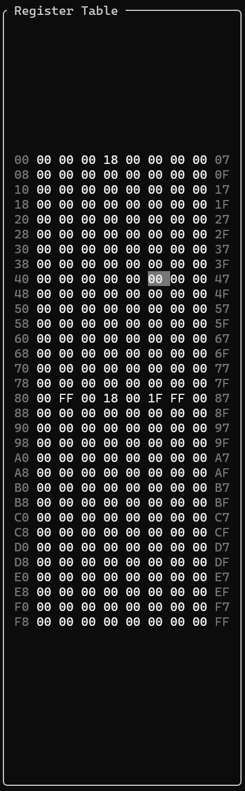
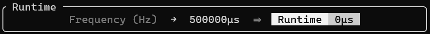
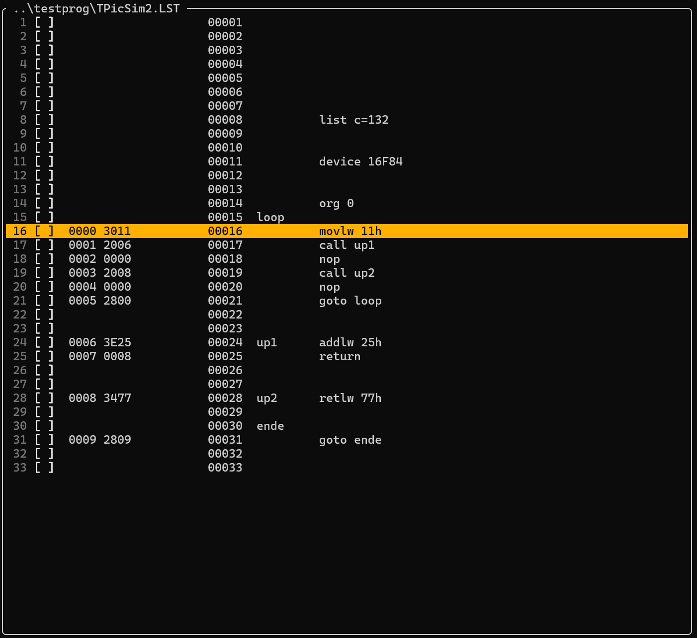

# Dokumentation
## PIC16F84-Simulator

##  Arbeitsweise eines Simulators
Simulatoren ermöglichen es, komplexe Systeme und Prozesse in einer sicheren und kontrollierten Umgebung zu erproben und analysieren. Doch wie genau funktioniert eigentlich ein solcher Simulator?

Sie ermöglichen die Erforschung und Optimierung von Systemen und Prozessen, bevor diese in der realen Welt implementiert werden. Und er kann dazu beitragen, das Verständnis komplexer Zusammenhänge zu verbessern.

Im Kern basiert die Arbeitsweise eines Simulators auf einem mathematischen Modell. Dieses Modell bildet die realen Gesetze und Beziehungen des simulierten Systems ab. Je detaillierter und präziser dieses Modell ist, desto realistischer ist die Simulation.

Der Simulator benötigt Eingabedaten, um das Verhalten des Systems zu beeinflussen. Diese Eingaben können von einem Benutzer stammen. Sie können aber auch von vorprogrammierten Szenarien oder externen Datenquellen kommen.

Basierend auf dem mathematischen Modell und den Eingabedaten berechnet der Simulator (in Echtzeit) den Zustand des simulierten Systems.

##  Vor- und Nachteile einer Simulation
Sowohl die Nutzung von Simulatoren und Simulationen als auch die tatsächliche Realisierung eines Systems oder Prozesses haben ihre spezifischen Stärken und Schwächen. Die Wahl des geeigneten Ansatzes hängt stark vom jeweiligen Anwendungsfall, den Zielen und den verfügbaren Ressourcen ab.

**Was spricht für eine Simulation?**
Einer der größten Vorteile ist die Möglichkeit, gefährliche Szenarien und Extremsituationen zu untersuchen, ohne reale Risiken für Menschen oder teure Ausrüstung einzugehen. Simulatoren können oft deutlich kostengünstiger sein als der Bau und Betrieb realer Prototypen oder Systeme. Dies betrifft Materialkosten, Energieverbrauch, Personalaufwand und potenzielle Schäden. Zudem kann die Entwicklung und das Testen in einer simulierten Umgebung oft deutlich schneller erfolgen als die Realisierung und das Testen eines physischen Prototyps. Iterationen und Designänderungen lassen sich in der Simulation zügiger umsetzen.

Damit einher geht, dass Simulatoren eine einfache Änderung von Parametern, Umgebungsbedingungen und Szenarien ermöglichen. Dies erlaubt es, eine Vielzahl von Situationen schnell und effizient zu testen und zu analysieren, was in der realen Welt oft sehr aufwendig oder unmöglich wäre.

Die Möglichkeit unterschiedliche Szenarien aufzusetzen, ermöglicht es kontrollierbare und wiederholbare Lernumgebung zu realisieren. Benutzer können Fehler machen und daraus lernen, ohne reale Konsequenzen fürchten zu müssen. Komplexe Systeme und Abläufe können in vereinfachter Form dargestellt und schrittweise erlernt werden.
Dies erlaubt zudem die Untersuchung von Zuständen und Bedingungen, die in der realen Welt selten auftreten oder schwer zu reproduzieren sind. Dies kann wertvolle Erkenntnisse für das Design und den Betrieb von Systemen liefern.

Ein weiterer Vorteil ist die präzise Erfassung und Analyse einer Vielzahl von Datenpunkten während des simulierten Prozesses. Dies kann helfen, das Systemverhalten im Detail zu verstehen und Optimierungspotenziale zu identifizieren.

**Welche Nachteile begleiten eine Simulation?**
Die Realität ist oft komplexer als jedes mathematische Modell. Vereinfachungen und Annahmen im Modell können zu Ungenauigkeiten führen und die Aussagekraft der Simulation einschränken. Dadurch kann die Entwicklung eines qualitativ hochwertigen Simulators, insbesondere für komplexe Systeme sehr aufwendig und kostspielig sein.

Ebenfalls können Simulationen oft nicht alle unvorhersehbaren Ereignisse, Umwelteinflüsse oder menschlichen Faktoren berücksichtigen, die in der realen Welt auftreten können. Dies kann die Übertragbarkeit der Simulationsergebnisse auf die Realität beeinträchtigen. Ein rein virtuelles Verständnis kann manchmal vom tatsächlichen Verhalten in der realen Welt abweichen. Es besteht die Gefahr, dass Entscheidungen zu stark auf Simulationsergebnissen basieren, ohne die Ergebnisse durch reale Tests oder Erfahrungen zu validieren. 

Obwohl Simulatoren sehr realistisch sein können, fehlt oft die tatsächliche sensorische und emotionale Erfahrung, die bei der Interaktion mit einem realen System entsteht. Dies kann insbesondere in Trainingsanwendungen relevant sein, wo das "Gefühl" für eine Situation wichtig ist.


##  Programmoberfläche und deren Handhabung
Dieser Simulator des PIC16F84 wurde als Terminal User Interface (kurz TUI) implementiert. Dies bedeutet, dass die Anwendung vollständig innerhalb eines Terminal-Emulators angezeigt und ausgeführt wird. Der Nutzer ist hierbei nicht auf die Wahl des Terminal-Emulators beschränkt. Dieser kann unter Windows frei zwischen unterschiedlichen Emulatoren, wie dem Windows Terminal, Alacritty und weiteren wählen. Zudem kann der Simulator in den ausgewählten Terminal-Emulatoren über die klassiche Windows Eingabeaufforderung, die ältere Windows PowerShell oder moderne Microsoft PowerShell 7 gestartet werden. Aber auch hier ist der Nutzer nicht auf die drei genannten Optionen beschränkt, solange die gewählten Kombinationen die Ausführung einer Windows Executable (.exe) mit zusätzlichen Argumenten unterstützen.

### Starten des Simulators
Wie bereits im Einführungstext dieses Abschnittes angeschnitten, wird der Simulator primär über ein Terminal Interface gestartet. Damit der Simulator erfolgreich starten kann, muss dem Ausführungsbefehl der Pfad zu einer Programmdatei für den PIC16F84 als Argument übergeben werden.

**Befehl zur Ausführung für die Windows Eingabeaufforderung:**
```bash
picsim.exe <Pfad_zur_Programmdatei>
```
**Befehl zur Ausführung für PowerShell 7:**
```bash
.\picsim.exe <Pfad_zur_Programmdatei>
```

Nach Ausführen des Befehls öffnet sich in der aktuellen Sitzung das TUI des Simulators. Sollte beim Start des Simulators ein Fehler aufgetreten sein, wird dieser stattdessen in der Ausgabe des Terminal Emulators angezeigt.

### Layout des Simulators
Das Interface des Simulators ist in mehrere Sektionen unterteilt. Die Sektionen sind:
- Controls
- Logs (standardmäßig ausgeblendet)
- Reset SFRs (standardmäßig ausgeblendet)
- Stats (standardmäßig ausgeblendet)
- Special File Registers
- Register Table
- Runtime
- LED-Array
- "Editor Window" (zeigt den Pfad zur Programmdatei)

#### Controls



Das Controls-Fenster befindet sich zu jedem Zeitpunkt am oberen Rand des Programmfensters. Dieses Fenster wird grundlegend dafür verwendet die Hauptfunktionen des Simulators zu steuern. In dieser Sektionen befinden sich daher ein Link zum öffnen der Dokumentation, Schaltflächen zur Interaktion des simulierten Programmes, sowie Schaltflächen zum Anzeigen und Ausblenden der Fenster [Logs](#logs), [Reset SFRs](#reset-sfrs) und [Stats](#stats). Ebenfalls in diesem Fenster befindet sich eine Status-LED die den Nutzer über den Zustand running/not running des ausgewählten Programmes informiert.

Bei den Schaltflächen zur Interaktion mit dem simulierten Programm handelt es sich um Go, Reset, Halt und Stop. Die Schaltfläche Go kann zum Starten und Fortfahren eines Programmdurchgangs verwendet werden. Ein Klick auf diese Schaltfläche schaltet die Status-LED an. Die Schaltfläche Reset unterbricht den aktuellen Programmdurchgang und setzt sämtliche Speicher und Einstellungen auf ihren Standardwert zurück. Die Status-LED erlischt dabei. Ebenfalls erlischt die Status-LED bei einem Klick auf die Schaltfläche Halt. Dabei wird der aktuelle Programmdurchlauf unterbrochen, aber nicht abgebrochen. Sämtliche Einstellungen bleiben erhalten. Nach einem Klick auf Halt kann der unterbrochene Programmablauf mit einem Klick auf Go oder Step fortgeführt werden.
Die Schaltfläche Step kann verwendet werden, um das geladene Programm schrittweise auszuführen. Bei einem Klick auf Step verändert sich der Zustand der Status-LED nicht. 

#### Logs



Das Logs-Fenster ist beim Start des Simulators standardmäßig eingeklappt, da dieses keine für den Programmablauf des Simulators relevanten Daten anzeigt. Es kann jedoch über die Schaltfläche Show Logs im Controls-Fenster eingeblendet werden. Daraufhin wird dieses direkt unterhalb des Controls-Fenster angezeigt und zeigt die letzten 5 Log-Ausgaben des Simulators. Ein gesamter Verlauf der Log-Ausgaben kann über die picsim.log-Datei, welche im Verzeichnis der Ausführungsdatei generiert wird, eingesehen werden.

Das Log-Fenster codiert sämtliche Ausgaben farbig abhängig von der Bedeutung des Inhaltes. Dabei wird zwischen folgenden Ausgabetypen unterschieden:

- Info (Blau)
- Warning (Orange)
- Error (Rot)

Diese Farben werden jedoch nicht in der Log-Datei widergespiegelt.

Mit einem Klick auf die "Hide Logs"-Schaltfläche kann das Logs-Fenster wieder ausgeblendet werden.

#### Reset SFRs



Ebenfalls initial ausgeblendet ist das "Reset SFRs"-Fenster, welches Schaltflächen zum Zurücksetzen sämtlicher Special Function Register zur Verfügung stellt. 

Bei diesen handelt es sich um:

- TMR0
- PCL
- STATUS
- FSR
- PORTA
- PORTB
- EEDATA
- EEADR
- PCLATH
- INTCON
- OPTION
- TRISA
- TRISB
- EECON1
- EECON2
- W-REG

Das Zurücksetzen der SFRs unterbricht keinen zu dem Zeitpunkt laufenden Programmdurchlauf. Das Zurücksetzen während eines Programmdurchlaufes kann demnach zu unerwartetem Verhalten führen. Alternativ können sämtliche Register über die Schaltfläche Reset im Controls-Fenster zurückgesetzt werden. Dabei wird ein zu dem Zeitpunkt laufender Programmdurchlauf jedoch abgebrochen.

Dargestellt wird dieses unterhalb des Controls- und Logs-Fenster (falls eingeblendet).

#### Stats



Innerhalb des Stats-Fensters werden Informationen zu speziellen Registern angezeigt, die für den aktuellen Programmablauf relevant sein könnten. Dieses Fenster wird jedoch nicht bei Start des Simulators angezeigt, da einige der hier sichtbaren Informationen auch an anderer Stelle in der TUI eingesehen werden können. Das Stats-Fenster bietet in seiner Darstellung jedoch eine einfache und schnelle Einsicht in die wichtigsten Informationen.

Darunter fallen:

- PC (Program Counter)
- PCLATH (Program Counter High Latch)
- PCL (Program Counter Low)
- FSR (File Select Register)
- Status
- SP (Stack Pointer)

#### Special File Registers



Das Special-Files-Registers-Fenster präsentiert dem Nutzer Informationen über unterschiedliche SFRs des PIC16F84 und weitere wichtige Informationen über die Laufzeit.

Die erste Information, die sich in diesem Fenster findet, ist der Stack. Dort werden die acht Einträge im Stack binär dargestellt. Der TOS ("Top of Stack") wird mit ebenfalls in diesem Fenster mit einem Stern ("*") hervorgehoben.
Links neben dem Stack befinden sich die drei Flags Zero, Digit Carry und Carry. Dieser Abschnitt zeigt jedoch nur den Inhalt des Fensters, ermöglicht jedoch keine manuelle Manipulation der Flags.
Unterhalb der Flags- und dem Stack-Abschnitt befinden sich das Status und W-Register. Der Inhalt des W-Register kann nicht manipuliert werden und zeigt nur den Inhalt darin binär und hexadezimal aufgeschlüsselt.
Die Status-Register-Bits können jedoch vom Nutzer händisch manipuliert werden. Bei den Bits im Status-Register handelt es sich von High- nach Low-Bit um:

- IRP (Register Bank Select)
- RP1 (Register Bank 1 Select Bit)
- RP0 (Register Bank 0 Select Bit)
- TO (Time-Out)
- PD (Power-Down)
- Z (Zero)
- DC (Digit Carry)
- C (Carry)

Ausnahme hier ist jedoch das IRP-Bit, da dieses nicht in den Mikrocontrollern der Reihe PIC16F8X implementiert ist. Benötigt wird dieses bei anderen Mikrocontrollern zum selektieren von Bänken, falls mehr als zwei Bänke vorhanden sind, was beim PIC16F84 nicht der Fall ist.
Von den Bits TO und PD abgesehen, werden die restlichen Bits mit 0 initialisiert. TO und PD mit 1.

Der letzte Abschnitt im Special-Files-Registers-Fenster stellt die Pin- und Tris-Bits der Ports A und B dar.
Ist ein Tris-Bit auf Input ("i") gestellt, kann das korrespondierende Port Bit vom Nutzer manuell umgeschaltet werden, um so ein Signal von außerhalb des Mikrocontroller zu simulieren. Ist das Tris-Bit hingegen auf Output ("o") gestellt, wird die Schaltfläche für das korrespondierende Pin-Bit abgeschaltet und kann nicht mehr manuell manipuliert werden.

Im Fall des Port A, sind die Tris-Bits 7-5 standardmäßig auf auf Output initialisiert, da diese nicht im Mikrocontroller implementiert sind. Dadurch sind diese 3 Bits nicht zur Verwendung vorgesehen und abgeschaltet. Die anderen Tris-Bits werden entsprechend der Spezifikation auf Input initialisiert.

#### Register Table



Im Fenster Register Table werden die Register des Mikrocontroller visualisiert. Darunter zählen die Bänke 0 und 1. Bank 0 wird von den Adressen 00 - 7F dargestellt und Bank 1 von der Adressen 80 - FF. Der Inhalt der Register wird hexadezimal innerhalb von Input-Feldern dargestellt. Dies ermöglicht dem Nutzer eine direkte Manipulation sämtlicher Register des PIC durch Eingabe eines neuen Wertes.

Hinweis: Die Eingabe eines Wertes in ein Input-Feld wird stets auf zwei Hex-Stellen vervollständigt und direkt im Register aktualisiert. Dies kann zwischenzeitig zu unvollständigen, fehlerhaften Eingaben führen und dementsprechend zu unvorhergesehenem Verhalten eines Programmes innerhalb der Simulation. 

Auffallend ist, dass nicht alle Register mit 0x00 initialisiert werden. Bei diesen handelt es sich um die Tris- und Port-Pin-Register, sowie das STATUS-Register und OPTION-Register.

Jede Zeile des Register-Table umfasst acht Register. Die Adresse des ersten Register in der Zeile wird links von der Zeile als Hexadezimalzahl angezeigt. Ebenfalls wird die Adresse des letzten Register in der Zeile am Ende der Zeile als Hexadezimalzahl dargestellt.

#### Runtime



Im Runtime-Fenster sieht der Nutzer die Laufzeit des aktuell simulierten Programms und kann dort die Quarz-Frequenz einstellen.

Die Frequenz kann im Input-Feld links im Runtime-Fenster eingegeben werden. Die Eingabe sollte in Hertz gemacht werden. Daraufhin wird die Frequenz in Mikrosekunden umgerechnet und rechts des Input-Feldes angezeigt.
Die aktuelle Laufzeit wird über den weiß/grauen Hintergrund hervorgehoben und zeigt die Anzahl an abgelaufenen Cycles an.

#### LED-Array


Das LED-Array-Fenster zeigt eine horizontale Anordnung von acht LEDs, welche an die acht Port B Pins gebunden sind. Stehen die korrespondierenden Pin Bits für Port B auf 1, fangen die entsprechenden LEDs im Array an zu leuchten. Voraussetzung für dies ist jedoch, dass die Tris B Bits an der entsprechenden Stelle auf Output ("o") gestellt sind. 

Angezeigt wird das LED-Array-Fenster oberhalb des Editor Fensters, rechts neben dem Runtime-Fenster.

#### Editor



Das Kernstück bildet das Editor-Fenster. Dieses Fenster trägt jedoch nicht den Namen Editor, sondern stellt den Dateipfad zur geladenen Datei dar, den der Nutzer beim Start des Simulators angegeben hat.
Beim Inhalt des Editor-Fensters handelt es sich um den Inhalt der geladenen Datei ohne Kommentare.
Jede Zeile des Editor-Fensters beinhaltet 3 Informationen:

- Zeilennummer
- Checkbox
- Programmzeile

Die Checkbox ermöglicht es dem Nutzer Breakpoints zu setzen, welche den Programmablauf an markierter Stelle unterbrechen. Breakpoints werden durch ein Kreuz in der Checkbox dargestellt sowie durch das Hinterlegen einer Zeile mit einem roten Hintergrund. Der Nutzer kann im Editor-Fenster in jeder Zeile einen Breakpoint setzen, auch wenn diese nicht für den Programmablauf relevant ist. Der Breakpoint wird in diesem Fall entsprechend ignoriert.


Außerdem wird in dem Editor-Fenster die Zeile, welche im Programmzähler als nächstes ausgeführt wird, mit der Farbe Orange hervorgehoben. Wird in dieser Zeile ein Breakpoint gesetzt behält diese ihren orangenen Hintergrund beim Zeileninhalt. Die Zeilennummer sowie die Checkbox erhalten jedoch einen roten Hintergrund, um das setzen eines Breakpoints zu signalisieren.

## Realisierung des Simulators

### Auswahl der Programmiersprache

Die Auswahl der Programmiersprache basiert im Falle der Entwicklung dieses Simulators nicht maßgeblich auf den konkreten Vor- und Nachteilen von C++. Hier könnte nun ein langer Abschnitt darüber verfasst werden, welche Vor- und Nachteile C++ bietet. Jedoch fiel die Entscheidung für C++ grundlegend durch den Wunsch und das Interesse ein TUI für den Simulator zu entwickeln. Da sich FTXUI als eine solide Wahl angeboten hat, fiel die Entscheidung, C++ zu verwenden zwangsläufig durch die Wahl des Frontend-Frameworks.

### Grundkonzept des Simulators

Der PIC16F84-Simulator wurde als sorgfältig konzipierte Software entwickelt, die das Verhalten des PIC16F84-Mikrocontrollers präzise nachbildet. Der Simulator ermöglicht es Entwicklern, PIC16F84-Programme zu testen und zu debuggen, ohne physische Hardware zu benötigen. Das Grundkonzept basiert auf der Idee einer abstrakten virtuellen Maschine, die die wesentlichen Komponenten des PIC16F84 emuliert:

1. **Speichermodell**: Simulation des Registerspeichers (RAM), des Programmspeichers (ROM), des EEPROMs und des Stacks
2. **CPU-Modell**: Nachbildung des Befehlssatzes und der Ausführungslogik des PIC16F84
3. **I/O-Simulation**: Emulation der Ein- und Ausgabeports (PORTA, PORTB) sowie der entsprechenden TRIS-Register
4. **Interrupt-System**: Simulation des Interrupt-Mechanismus des PIC16F84
5. **Timing-System**: Nachbildung der Taktfrequenz und der Ausführungszeiten

### Gliederung der Implementierung

Der Simulator ist in mehrere logische Module unterteilt:

1. **Memory-Management**: Verwaltet die verschiedenen Speichertypen (RAM, ROM, EEPROM, Stack)
2. **Instruction-Execution**: Führt die Befehlsinterpretation und -ausführung durch
3. **Decoder**: Wandelt Maschinencode in interpretierbare Befehle um
4. **I/O-Handling**: Simuliert das Verhalten der I/O-Ports und ihrer Steuerregister
5. **Interrupt-Controller**: Behandelt die Generierung und Verarbeitung von Interrupts
6. **User-Interface**: Bietet eine interaktive TUI (Terminal User Interface) für Benutzerinteraktionen
7. **Runtime-Engine**: Koordiniert die Programmausführung und das Timing

### Programmstruktur und Ablaufmodell

Das Simulationssystem ist als ereignisgesteuertes Modell implementiert, das den Ausführungszyklus des PIC16F84 nachbildet. Der Hauptablauf des Simulators folgt diesem Schema:

```
┌─────────────┐     ┌─────────────┐     ┌─────────────┐     ┌─────────────┐
│   Fetch     │────▶│   Decode    │────▶│   Execute   │────▶│   Update    │
│ Instruction │     │ Instruction │     │ Instruction │     │   State     │
└─────────────┘     └─────────────┘     └─────────────┘     └─────────────┘
       ▲                                                           │
       │                                                           │
       └───────────────────────────────────────────────────────────┘
```

Dieser Zyklus wird für jede Instruktion wiederholt. Zwischen den Zyklen werden auch etwaige Interrupts überprüft und behandelt. Die Ausführung kann durch Benutzeraktionen wie das Setzen von Breakpoints, Drücken der "Halt"-Taste oder durch interne Ereignisse wie Interrupts unterbrochen werden.

### Detaillierte Beschreibung ausgewählter Befehle

#### BTFSC/BTFSS (Bit Test File Skip if Clear/Set)

Diese Befehle testen ein bestimmtes Bit in einem Registerinhalt und überspringen die nächste Instruktion, falls das getestete Bit 0 (bei BTFSC) oder 1 (bei BTFSS) ist.

```cpp
void BitExecution::executeBTFSC(const Instruction& instruction) {
    Logger::info("executing " + instruction.toString());
    int address = executor.getFileAddress(instruction);
    auto bank = executor.getSelectedBank(instruction);
    int bit = instruction.getArguments()[1];

    uint8_t value = executor.getRamContent(bank, address);
    
    // Wenn das Bit 0 ist, überspringe die nächste Instruktion
    if (((value >> bit) & 1) == 0) {
        executor.setProgramCounter(executor.getProgramCounter() + 1);
    }
}
```

Ablauf:
1. Der Registerinhalt an der angegebenen Adresse wird gelesen
2. Das angegebene Bit wird durch Rechtsverschieben und Maskieren isoliert
3. Falls das Bit den erwarteten Wert hat, wird der Programmzähler inkrementiert

#### CALL (Call Subroutine)

Dieser Befehl ruft eine Unterfunktion auf, indem er die aktuelle Adresse auf den Stack legt und zum Ziel springt.

```cpp
void JumpExecution::executeCALL(const Instruction& instruction) {
    Logger::info("executing " + instruction.toString());
    int address = instruction.getArguments()[0];
    
    // Aktuelle Adresse auf Stack speichern
    executor.pushStack(executor.getProgramCounter());
    
    // PCLATH-Bits berücksichtigen und zu Zieladresse springen
    uint8_t pclath = executor.getRamContent(RamMemory<uint8_t>::SFR::entries()[9]);
    int pclathBits = (pclath & 24) << 8; 
    address = (address & 2047) | pclathBits;
    
    executor.setProgramCounter(address);
}
```

Ablauf:
1. Die aktuelle Programmzähleradresse wird auf den Stack gepusht
2. Die höherwertigen Bits aus PCLATH werden mit der Zieladresse kombiniert
3. Der Programmzähler wird auf die resultierende Adresse gesetzt

#### MOVF (Move File)

Dieser Befehl kopiert den Inhalt eines Registers entweder in das W-Register oder zurück in das gleiche Register.

```cpp
void ByteExecution::executeMOVF(const Instruction& instruction) {
    Logger::info("executing " + instruction.toString());
    int address = executor.getFileAddress(instruction);
    auto bank = executor.getSelectedBank(instruction);

    uint8_t value = executor.getRamContent(bank, address);
    
    // Zero-Flag setzen
    executor.checkZeroFlag(value);

    // Wenn d=0, in W-Register speichern, sonst zurück in gleiche Adresse
    if (instruction.getArguments()[0] == 0) {
        executor.setWorkingRegister(value);
    } else {
        executor.setRamContent(bank, address, value);
    }
}
```

Ablauf:
1. Der Wert des angegebenen Registers wird gelesen
2. Das Zero-Flag wird entsprechend dem Wert gesetzt
3. Je nach d-Bit wird der Wert in das W-Register oder zurück in dasselbe Register geschrieben

#### RRF (Rotate Right File)

Rotiert die Bits eines Registers nach rechts durch das Carry-Flag.

```cpp
void ByteExecution::executeRRF(const Instruction& instruction) {
    Logger::info("executing " + instruction.toString());
    int address = executor.getFileAddress(instruction);
    auto bank = executor.getSelectedBank(instruction);

    uint8_t value = executor.getRamContent(bank, address);
    uint8_t newCarryFlag = value & 0x01; // Niedrigstwertiges Bit wird neues Carry-Flag

    // Rotiere nach rechts und füge Carry als MSB ein
    value = (value >> 1) | (executor.isCarryFlag() ? 0x80 : 0x00);

    // Neues Carry-Flag setzen
    executor.checkCarryFlag(newCarryFlag);
    
    // Je nach d-Bit in W-Register oder zurück in Register speichern
    if (instruction.getArguments()[0] == 0) {
        executor.setWorkingRegister(value);
    } else {
        executor.setRamContent(bank, address, value);
    }
}
```

Ablauf:
1. Der Wert des angegebenen Registers wird gelesen
2. Das niedrigste Bit wird gespeichert als neues Carry-Flag
3. Der Wert wird um 1 Bit nach rechts verschoben, wobei das aktuelle Carry-Flag als höchstwertiges Bit eingefügt wird
4. Das neue Carry-Flag wird gesetzt
5. Je nach d-Bit wird der Wert in das W-Register oder zurück in das Register geschrieben

#### SUBWF (Subtract W from File)

Subtrahiert den Inhalt des W-Registers vom Inhalt eines Registers.

```cpp
void ByteExecution::executeSUBWF(const Instruction& instruction) {
    Logger::info("executing " + instruction.toString());
    int address = executor.getFileAddress(instruction);
    auto bank = executor.getSelectedBank(instruction);

    uint8_t value = executor.getRamContent(bank, address);
    int result = (0xFF & value) - (0xFF & executor.getWorkingRegister());

    // Carry ist hier umgekehrt: 1 bei keinem Überlauf, 0 bei Überlauf
    executor.checkDigitCarryFlag(((value & 0xF) - (executor.getWorkingRegister() & 0xF)) >= 0);
    executor.checkCarryFlag(value >= executor.getWorkingRegister());
    executor.checkZeroFlag(result);

    if (instruction.getArguments()[0] == 0) {
        executor.setWorkingRegister(static_cast<uint8_t>(result));
    } else {
        executor.setRamContent(bank, address, static_cast<uint8_t>(result));
    }
}
```

Ablauf:
1. Der Wert des angegebenen Registers wird gelesen
2. Der Wert des W-Registers wird vom gelesenen Wert subtrahiert
3. Die Flags (Digit-Carry, Carry, Zero) werden aktualisiert
4. Je nach d-Bit wird das Ergebnis in das W-Register oder zurück in das Register geschrieben

#### DECFSZ (Decrement File, Skip if Zero)

Dekrementiert den Inhalt eines Registers und überspringt die nächste Instruktion, wenn das Ergebnis null ist.

```cpp
void ByteExecution::executeDECFSZ(const Instruction& instruction) {
    Logger::info("executing " + instruction.toString());
    int address = executor.getFileAddress(instruction);
    auto bank = executor.getSelectedBank(instruction);

    uint8_t value = executor.getRamContent(bank, address);
    int result = value - 1;

    // Wenn Ergebnis 0, überspringe nächste Instruktion
    if (result == 0) {
        executor.setProgramCounter(executor.getProgramCounter() + 1);
    }

    if (instruction.getArguments()[0] == 0) {
        executor.setWorkingRegister(static_cast<uint8_t>(result));
    } else {
        executor.setRamContent(bank, address, static_cast<uint8_t>(result));
    }
}
```

Ablauf:
1. Der Wert des angegebenen Registers wird gelesen
2. Der Wert wird um 1 dekrementiert
3. Falls das Ergebnis 0 ist, wird die nächste Instruktion übersprungen
4. Je nach d-Bit wird das Ergebnis in das W-Register oder zurück in das Register geschrieben

#### XORLW (XOR Literal with W)

Führt eine bitweise XOR-Operation zwischen einem Literal und dem W-Register durch.

```cpp
void LiteralExecution::executeXORLW(const Instruction& instruction) {
    Logger::info("executing " + instruction.toString());
    int literal = instruction.getArguments()[0];
    
    int result = literal ^ executor.getWorkingRegister();
    
    executor.checkZeroFlag(result);
    executor.setWorkingRegister(static_cast<uint8_t>(result));
}
```

Ablauf:
1. Der Literalwert wird aus der Instruktion extrahiert
2. Eine XOR-Operation zwischen dem Literal und dem W-Register wird durchgeführt
3. Das Zero-Flag wird entsprechend aktualisiert
4. Das Ergebnis wird in das W-Register geschrieben

### Realisierung der Flags und deren Wirkungsmechanismen

Die Flags im PIC16F84 werden im STATUS-Register (Adresse 0x03) gespeichert und spielen eine wichtige Rolle bei der bedingten Ausführung und der Zustandskontrolle. Die wichtigsten Flags sind:

1. **Zero Flag (Z)**: Wird auf 1 gesetzt, wenn das Ergebnis einer Operation 0 ist
2. **Carry Flag (C)**: Zeigt einen Übertrag an oder wird als Borge-Flag bei Subtraktionen verwendet
3. **Digit Carry Flag (DC)**: Zeigt einen Übertrag vom 4. zum 5. Bit an (wichtig für BCD-Operationen)

Die Flags werden durch verschiedene Funktionen in der `InstructionExecution`-Klasse verwaltet:

```cpp
bool InstructionExecution::checkZeroFlag(int value) {
    ram.set(STATUS, (value & 0xFF) == 0 ? ram.get(STATUS) | 0x04 : ram.get(STATUS) & ~0x04);
    return (value & 0xFF) == 0;
}

bool InstructionExecution::checkCarryFlag(bool condition) {
    ram.set(STATUS, condition ? ram.get(STATUS) | 0x01 : ram.get(STATUS) & ~0x01);
    return condition;
}

bool InstructionExecution::checkDigitCarryFlag(bool condition) {
    ram.set(STATUS, condition ? ram.get(STATUS) | 0x02 : ram.get(STATUS) & ~0x02);
    return condition;
}

bool InstructionExecution::isCarryFlag() const {
    return (ram.get(STATUS) & 0x01) != 0;
}

bool InstructionExecution::isZeroFlag() const {
    return (ram.get(STATUS) & 0x04) != 0;
}

bool InstructionExecution::isDigitCarryFlag() const {
    return (ram.get(STATUS) & 0x02) != 0;
}
```

Diese Flags werden bei verschiedenen Operationen gesetzt oder zurückgesetzt und können durch die bedingt ausführenden Befehle wie BTFSC oder BTFSS geprüft werden.

### Implementierung von Interrupts

Der PIC16F84 unterstützt verschiedene Interrupt-Quellen, darunter:
- Timer0-Überlauf
- RB0/INT externe Interrupts
- RB Port-Change-Interrupts

Die Implementierung folgt dem Interrupt-Mechanismus des PIC16F84:

```cpp
bool InstructionExecution::checkTMR0Interrupt() {
    return (ram.get(INTCON) & 0b10100100) == 0xA4;
}

bool InstructionExecution::checkRB0Interrupt() {
    return (ram.get(INTCON) & 0b10010010) == 0x92;
}

bool InstructionExecution::checkRBInterrupts() {
    return (ram.get(INTCON) & 0b10001001) == 0x89;
}

void InstructionExecution::callISR(int address) {
    ram.set(INTCON, ram.get(INTCON) & 0b01111111);
    stack.push(programCounter);

    int pclathBits = (ram.get(PCLATH) & 24) << 8;
    address = (address & 2047) | pclathBits;

    setProgramCounter(address);
}
```

Der Ablauf der Interrupt-Behandlung ist:
1. Bei jedem Ausführungszyklus werden die Interrupt-Bedingungen geprüft
2. Wenn ein Interrupt angefordert und freigegeben ist, wird die Interrupt-Service-Routine aufgerufen
3. Der aktuelle Programmzähler wird auf den Stack gepusht
4. Das Global Interrupt Enable (GIE) Bit wird gelöscht
5. Der Programmzähler wird auf die Interrupt-Vektor-Adresse (0x0004) gesetzt
6. Nach Abschluss der ISR wird mit RETFIE zurückgekehrt, was GIE wiederherstellt

### Realisierung der TRIS-Register-Funktion

Die TRIS-Register im PIC16F84 steuern die Datenrichtung der I/O-Ports. Jedes Bit in einem TRIS-Register bestimmt, ob der entsprechende Pin als Eingang (1) oder Ausgang (0) konfiguriert ist.

Die TRIS-Funktion ist als Latchmechanismus implementiert:

```cpp
template <typename T>
void RamMemory<T>::set(Bank bank, int address, const T& value) {
    std::lock_guard<std::mutex> lock(mutex);
    if (address < 0 || address >= bank0.size()) {
        throw std::out_of_range("Address isn't implemented");
    }
    
    Logger::info("set value: " + std::to_string(value)+ " to address: " + std::to_string(address));
    int oldValue = (bank == Bank::BANK_0) ? bank0[address] : bank1[address];
    
    // Prüfen, ob es sich um ein SFR handelt
    bool isSFR = address < 0x0C;
    bool shouldMirror = false;
    
    // Für SFRs: Nur spiegeln, wenn das Register in beiden Bänken verfügbar ist
    if (isSFR) {
        // Prüfen, ob das SFR an dieser Adresse gespiegelt ist
        for (const auto& sfr : SFR::entries()) {
            if (sfr.address == address && (sfr.bank == bank)) {
                shouldMirror = sfr.mapped;
                break;
            }
        }
    } else {
        // Für GPRs: Immer spiegeln (vollständige Spiegelung ab 0x0C)
        shouldMirror = true;
    }
    
    if (bank == Bank::BANK_0) {
        bank0[address] = value;
        if (shouldMirror) {
            bank1[address] = value; // Spiegelung zur Bank 1
        }
    } else {
        bank1[address] = value;
        if (shouldMirror) {
            bank0[address] = value; // Spiegelung zur Bank 0
        }
    }
    
    firePropertyChange("ram", address, oldValue, value);
}
```

Die Implementierung der TRIS-Bits in der Benutzeroberfläche ist so gestaltet, dass sie das erwartete Verhalten nachbildet: Wenn ein TRIS-Bit auf 1 (Eingang) gesetzt ist, kann der entsprechende Port-Pin vom Benutzer manipuliert werden, um Eingangssignale zu simulieren. Wenn ein TRIS-Bit auf 0 (Ausgang) gesetzt ist, wird der entsprechende Port-Pin vom Programm gesteuert und der Benutzer kann ihn nicht direkt ändern.

### EEPROM-Implementierung mit State-Machine

Die EEPROM-Funktionalität des PIC16F84 wurde als Zustandsautomat implementiert, der den Lese- und Schreibzyklus des echten EEPROM emuliert:

```
┌─────────────┐     ┌─────────────┐     ┌─────────────┐
│    IDLE     │────▶│  READ_MODE  │────▶│ READING     │
└─────────────┘     └─────────────┘     └─────────────┘
      │                                        │
      │                                        │
      ▼                                        ▼
┌─────────────┐     ┌─────────────┐     ┌─────────────┐
│ WRITE_MODE  │────▶│  WRITING    │────▶│  COMPLETE   │
└─────────────┘     └─────────────┘     └─────────────┘
```

Der EEPROM-Controller überwacht Änderungen an den relevanten Registern (EEADR, EEDATA, EECON1, EECON2) und führt entsprechende Operationen basierend auf dem aktuellen Zustand aus:

```cpp
void InstructionExecution::init() {
    // Observe RAM memory for detecting reading/writing the EEPROM
    ram.addPropertyChangeListener("ram", [this](int address, uint8_t oldValue, uint8_t newValue) {
        if (address == EECON1.address) {
            if ((newValue & 0b10) && (newValue & 0b1)) { // Check RD and WR bits
                if (newValue & 0b10) { // RD bit
                    ram.set(EEDATA, eeprom.get(ram.get(EEADR)));
                }
                if (newValue & 0b1) { // WR bit
                    eeprom.set(ram.get(EEADR), ram.get(EEDATA));
                }
                ram.set(EECON1, newValue & 0b11111100); // Clear RD and WR bits
            }
        }
    });
}
```

Diese Implementierung stellt sicher, dass das EEPROM-Verhalten des PIC16F84 korrekt simuliert wird, einschließlich der Zugriffsregeln und Timing-Aspekte.

## Fazit

Der im Rahmen dieses Projekts entwickelte PIC16F84-Simulator stellt eine umfassende softwarebasierte Nachbildung des physischen Mikrocontrollers dar. Die zentrale Frage, wie weit die Funktionen des Bausteins per Software nachgebildet werden konnten, lässt sich wie folgt beantworten:

Die Hauptfunktionen des PIC16F84 konnten nahezu vollständig implementiert werden. Der komplette 35 Instruktionen umfassende Befehlssatz wurde originalgetreu nachgebildet, wobei jeder Befehl die korrekte Anzahl von Taktzyklen benötigt und die entsprechenden Auswirkungen auf Register, Speicher und Flags hat. 

Bei der Entwicklung dieses Simulators sind mehrere Hürden überwunden worden. Eine maßgebliche Schwierigkeit bei der Entwicklung des User Interface waren die Konflikte mit dem regelmäßigen loggen essentieller Informationen über den Ablauf des Programs. Da die Anwendung innerhalb eines Terminal läuft, Logging Informationen jedoch auch im Terminal ausgegeben werden, hat sich als Problem herausgestellt, dass die UI durch logging Ausgaben verschoben wurde und nicht mehr nutzbar war. Dieses Problem konnte jedoch durch die Verwendung von Multithreading und das Erstellen dedizierter Ausgabebereiche für Logging-Informationen in der UI und einer separaten Log-Datei behoben werden.

Ebenfalls als Schwierigkeit bei der Darstellung der UI herausgestellt hat sich das Layout und die Verbindung von Backend-Informationen im Editor-Fenster. Da die Entwicklung von Frontend und Backend separat voneinander abliefen, mussten nachträglich Änderungen im Backend vorgenommen werden, um die nötige Funktionalität im Editor-Fenster anbieten zu können.
So wurde im Backend beispielsweise sämtliche irrelevante Information aus der Datei für den Programmablauf entfernt, jedoch im Frontend wieder benötigt. Um nun breakpoints erstellen zu können musste nun eine Verknüpfung zwischen den Zeilennummern im Backend und dem Frontend aufgebaut werden.

Ansonsten gab es keine weiteren größeren Schwierigkeiten bei der Entwicklung der UI mit FTXUI. Obwohl beide Personen in der Gruppe noch keine Erfahrung bei der Entwicklung einer UI mit FTXUI hatten, konnten viele Elemente und Erfahrungen aus der Entwicklung mit React aufgegriffen und bei der Entwicklung des TUI angewendet werden. Im Großen und Ganzen konnte die Erfahrung bei der Entwicklung der UI mit FTXUI als positiv beschrieben werden.