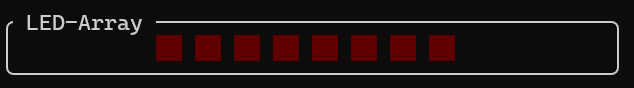

# Dokumentation
## PIC16F84-Simulator

##  Arbeitsweise eines Simulators
Simulatoren ermöglichen es, komplexe Systeme und Prozesse in einer sicheren und kontrollierten Umgebung zu erproben und analysieren. Doch wie genau funktioniert eigentlich ein solcher Simulator?

Sie ermöglichen die Erforschung und Optimierung von Systemen und Prozessen, bevor diese in der realen Welt implementiert werden. Und er kann dazu beitragen, das Verständnis komplexer Zusammenhänge zu verbessern.

Im Kern basiert die Arbeitsweise eines Simulators auf einem mathematischen Modell. Dieses Modell bildet die realen Gesetze und Beziehungen des simulierten Systems ab. Je detaillierter und präziser dieses Modell ist, desto realistischer ist die Simulation.

Der Simulator benötigt Eingabedaten, um das Verhalten des Systems zu beeinflussen. Diese Eingaben können von einem Benutzer stammen. Sie können aber auch von vorprogrammierten Szenarien oder externen Datenquellen kommen.

Basierend auf dem mathematischen Modell und den Eingabedaten berechnet der Simulator (in Echtzeit) den Zustand des simulierten Systems.

##  Vor- und Nachteile einer Simulation
Sowohl die Nutzung von Simulatoren und Simulationen als auch die tatsächliche Realisierung eines Systems oder Prozesses haben ihre spezifischen Stärken und Schwächen. Die Wahl des geeigneten Ansatzes hängt stark vom jeweiligen Anwendungsfall, den Zielen und den verfügbaren Ressourcen ab.

**Was spricht für eine Simulation?**
Einer der größten Vorteile ist die Möglichkeit, gefährliche Szenarien und Extremsituationen zu untersuchen, ohne reale Risiken für Menschen oder teure Ausrüstung einzugehen. Simulatoren können oft deutlich kostengünstiger sein als der Bau und Betrieb realer Prototypen oder Systeme. Dies betrifft Materialkosten, Energieverbrauch, Personalaufwand und potenzielle Schäden. Zudem kann die Entwicklung und das Testen in einer simulierten Umgebung oft deutlich schneller erfolgen als die Realisierung und das Testen eines physischen Prototyps. Iterationen und Designänderungen lassen sich in der Simulation zügiger umsetzen.

Damit einher geht, dass Simulatoren eine einfache Änderung von Parametern, Umgebungsbedingungen und Szenarien ermöglichen. Dies erlaubt es, eine Vielzahl von Situationen schnell und effizient zu testen und zu analysieren, was in der realen Welt oft sehr aufwendig oder unmöglich wäre.

Die Möglichkeit unterschiedliche Szenarien aufzusetzen, ermöglicht es kontrollierbare und wiederholbare Lernumgebung zu realisieren. Benutzer können Fehler machen und daraus lernen, ohne reale Konsequenzen fürchten zu müssen. Komplexe Systeme und Abläufe können in vereinfachter Form dargestellt und schrittweise erlernt werden.
Dies erlaubt zudem die Untersuchung von Zuständen und Bedingungen, die in der realen Welt selten auftreten oder schwer zu reproduzieren sind. Dies kann wertvolle Erkenntnisse für das Design und den Betrieb von Systemen liefern.

Ein weiterer Vorteil ist die präzise Erfassung und Analyse einer Vielzahl von Datenpunkten während des simulierten Prozesses. Dies kann helfen, das Systemverhalten im Detail zu verstehen und Optimierungspotenziale zu identifizieren.

**Welche Nachteile begleiten eine Simulation?**
Die Realität ist oft komplexer als jedes mathematische Modell. Vereinfachungen und Annahmen im Modell können zu Ungenauigkeiten führen und die Aussagekraft der Simulation einschränken. Dadurch kann die Entwicklung eines qualitativ hochwertigen Simulators, insbesondere für komplexe Systeme sehr aufwendig und kostspielig sein.

Ebenfalls können Simulationen oft nicht alle unvorhersehbaren Ereignisse, Umwelteinflüsse oder menschlichen Faktoren berücksichtigen, die in der realen Welt auftreten können. Dies kann die Übertragbarkeit der Simulationsergebnisse auf die Realität beeinträchtigen. Ein rein virtuelles Verständnis kann manchmal vom tatsächlichen Verhalten in der realen Welt abweichen. Es besteht die Gefahr, dass Entscheidungen zu stark auf Simulationsergebnissen basieren, ohne die Ergebnisse durch reale Tests oder Erfahrungen zu validieren. 

Obwohl Simulatoren sehr realistisch sein können, fehlt oft die tatsächliche sensorische und emotionale Erfahrung, die bei der Interaktion mit einem realen System entsteht. Dies kann insbesondere in Trainingsanwendungen relevant sein, wo das "Gefühl" für eine Situation wichtig ist.


##  Programmoberfläche und deren Handhabung
Dieser Simulator des PIC16F84 wurde als Terminal User Interface (kurz TUI) implementiert. Dies bedeutet, dass die Anwendung vollständig innerhalb eines Terminal-Emulators angezeigt und ausgeführt wird. Der Nutzer ist hierbei nicht auf die Wahl des Terminal-Emulators beschränkt. Dieser kann unter Windows frei zwischen unterschiedlichen Emulatoren, wie dem Windows Terminal, Alacritty und weiteren wählen. Zudem kann der Simulator in den ausgewählten Terminal-Emulatoren über die klassiche Windows Eingabeaufforderung, die ältere Windows PowerShell oder moderne Microsoft PowerShell 7 gestartet werden. Aber auch hier ist der Nutzer nicht auf die drei genannten Optionen beschränkt, solange die gewählten Kombinationen die Ausführung einer Windows Executable (.exe) mit zusätzlichen Argumenten unterstützen.

### Starten des Simulators
Wie bereits im Einführungstext dieses Abschnittes angeschnitten, wird der Simulator primär über ein Terminal Interface gestartet. Damit der Simulator erfolgreich starten kann, muss dem Ausführungsbefehl der Pfad zu einer Programmdatei für den PIC16F84 als Argument übergeben werden.

**Befehl zur Ausführung für die Windows Eingabeaufforderung:**
```bash
picsim.exe <Pfad_zur_Programmdatei>
```
**Befehl zur Ausführung für PowerShell 7:**
```bash
.\picsim.exe <Pfad_zur_Programmdatei>
```

Nach Ausführen des Befehls öffnet sich in der aktuellen Sitzung das TUI des Simulators. Sollte beim Start des Simulators ein Fehler aufgetreten sein, wird dieser stattdessen in der Ausgabe des Terminal Emulators angezeigt.

### Layout des Simulators
Das Interface des Simulators ist in mehrere Sektionen unterteilt. Die Sektionen sind:
- Controls
- Logs (standardmäßig ausgeblendet)
- Reset SFRs (standardmäßig ausgeblendet)
- Stats (standardmäßig ausgeblendet)
- Special File Registers
- Register Table
- Runtime
- LED-Array
- "Editor Window" (zeigt den Pfad zur Programmdatei)

#### Controls


Das Controls-Fenster befindet sich zu jedem Zeitpunkt am oberen Rand des Programmfensters. Dieses Fenster wird grundlegend dafür verwendet die Hauptfunktionen des Simulators zu steuern. In dieser Sektionen befinden sich daher ein Link zum öffnen der Dokumentation, Schaltflächen zur Interaktion des simulierten Programmes, sowie Schaltflächen zum Anzeigen und Ausblenden der Fenster [Logs](#logs), [Reset SFRs](#reset-sfrs) und [Stats](#stats). Ebenfalls in diesem Fenster befindet sich eine Status-LED die den Nutzer über den Zustand running/not running des ausgewählten Programmes informiert.

Bei den Schaltflächen zur Interaktion mit dem simulierten Programm handelt es sich um Go, Reset, Halt und Stop. Die Schaltfläche Go kann zum Starten und Fortfahren eines Programmdurchgangs verwendet werden. Ein Klick auf diese Schaltfläche schaltet die Status-LED an. Die Schaltfläche Reset unterbricht den aktuellen Programmdurchgang und setzt sämtliche Speicher und Einstellungen auf ihren Standardwert zurück. Die Status-LED erlischt dabei. Ebenfalls erlischt die Status-LED bei einem Klick auf die Schaltfläche Halt. Dabei wird der aktuelle Programmdurchlauf unterbrochen, aber nicht abgebrochen. Sämtliche Einstellungen bleiben erhalten. Nach einem Klick auf Halt kann der unterbrochene Programmablauf mit einem Klick auf Go oder Step fortgeführt werden.
Die Schaltfläche Step kann verwendet werden, um das geladene Programm schrittweise auszuführen. Bei einem Klick auf Step verändert sich der Zustand der Status-LED nicht. 

#### Logs


Das Logs-Fenster ist beim Start des Simulators standardmäßig eingeklappt, da dieses keine für den Programmablauf des Simulators relevanten Daten anzeigt. Es kann jedoch über die Schaltfläche Show Logs im Controls-Fenster eingeblendet werden. Daraufhin wird dieses direkt unterhalb des Controls-Fenster angezeigt und zeigt die letzten 5 Log-Ausgaben des Simulators. Ein gesamter Verlauf der Log-Ausgaben kann über die picsim.log-Datei, welche im Verzeichnis der Ausführungsdatei generiert wird, eingesehen werden.

Das Log-Fenster codiert sämtliche Ausgaben farbig abhängig von der Bedeutung des Inhaltes. Dabei wird zwischen folgenden Ausgabetypen unterschieden:

- Info (Blau)
- Warning (Orange)
- Error (Rot)

Diese Farben werden jedoch nicht in der Log-Datei widergespiegelt.

Mit einem Klick auf die "Hide Logs"-Schaltfläche kann das Logs-Fenster wieder ausgeblendet werden.

#### Reset SFRs


Ebenfalls initial ausgeblendet ist das "Reset SFRs"-Fenster, welches Schaltflächen zum Zurücksetzen sämtlicher Special Function Register zur Verfügung stellt. 

Bei diesen handelt es sich um:

- TMR0
- PCL
- STATUS
- FSR
- PORTA
- PORTB
- EEDATA
- EEADR
- PCLATH
- INTCON
- OPTION
- TRISA
- TRISB
- EECON1
- EECON2
- W-REG

Das Zurücksetzen der SFRs unterbricht keinen zu dem Zeitpunkt laufenden Programmdurchlauf. Das Zurücksetzen während eines Programmdurchlaufes kann demnach zu unerwartetem Verhalten führen. Alternativ können sämtliche Register über die Schaltfläche Reset im Controls-Fenster zurückgesetzt werden. Dabei wird ein zu dem Zeitpunkt laufender Programmdurchlauf jedoch abgebrochen.

Dargestellt wird dieses unterhalb des Controls- und Logs-Fenster (falls eingeblendet).

#### Stats


Innerhalb des Stats-Fensters werden Informationen zu speziellen Registern angezeigt, die für den aktuellen Programmablauf relevant sein könnten. Dieses Fenster wird jedoch nicht bei Start des Simulators angezeigt, da einige der hier sichtbaren Informationen auch an anderer Stelle in der TUI eingesehen werden können. Das Stats-Fenster bietet in seiner Darstellung jedoch eine einfache und schnelle Einsicht in die wichtigsten Informationen.

Darunter fallen:

- PC (Program Counter)
- PCLATH (Program Counter High Latch)
- PCL (Program Counter Low)
- FSR (File Select Register)
- Status
- SP (Stack Pointer)

#### Special File Registers


#### Register Table


#### Runtime


#### LED-Array



#### Editor


## Realisierung des Simulator

## Zusammenfassung
